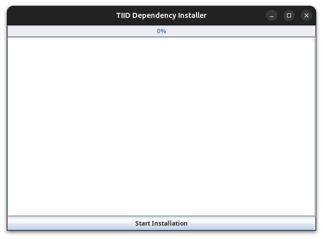
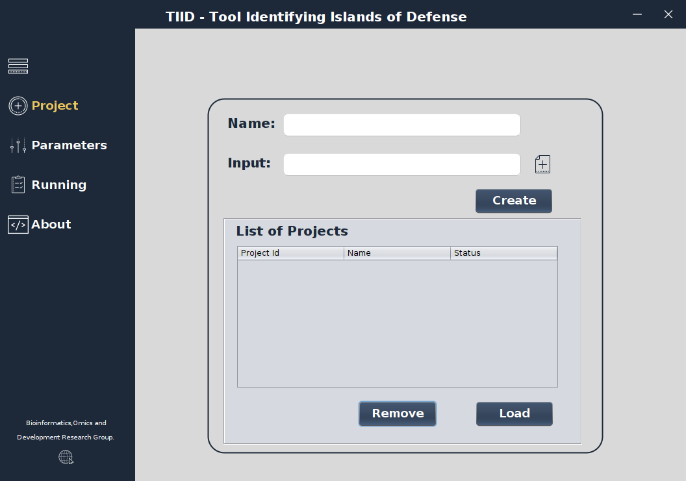
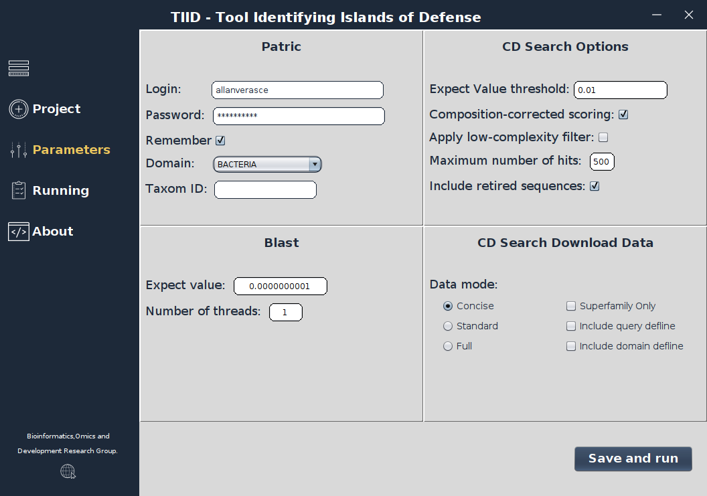
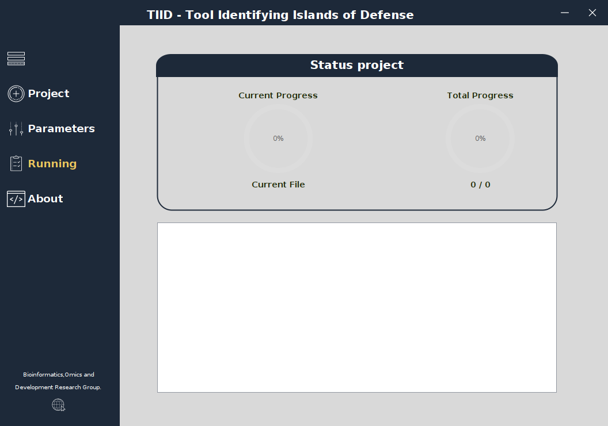

## TIID - A User-Friendly GUI Tool for Identifying Islands of Defense in Prokaryotic Genomes
<p align="justify">The red queen hypothesis portrays the evolutionary race between organisms to establish. Bacteria and phages are ubiquitous microorganisms constantly coevolving over billions of years. The hard evolutionary competition between bacteria and phages resulted in a strong evolutionary pressure that has led bacteria to develop a wide repertoire of anti-phage defense mechanism to prevent infection, called the prokaryotic immune system. It is currently known that a key feature of these anti-phage systems is that their genes are clustered in genomic islands known as defense islands. In-depth analysis of these regions helps to understand the distribution of immune genes in an organism and discover potential new defense systems. Here we present TIID, a user-friendly and JAVA GUI tool developed to identify defense island and its genes in prokaryotic genomes in an easy and fast way. The graphical interface of TIID, built using JAVA, offers optimal usability to users. Additionally, it features a database that oversees processing stages, ensuring seamless resumption in case of unexpected events. The validation process used two datasets: the first comprising 100 E. coli organisms, and the second consisting of 25 class-wide bacterial genomes. The results strongly support TIIDs efficiency on identifying defense islands and its associated genes across both genomes datasets, suggesting its wide applicability in both molecular and ecological studies in microbiology and new defense systems discovery.</p>

### Technology
<image src="https://github.com/allanverasce/allanverasce/assets/25986290/e9eef5db-3d9e-419d-bc31-c29c16076146" alt="Image" width="80"/>
<image src="https://github.com/allanverasce/allanverasce/assets/25986290/3f178481-786d-4e6f-b46f-7e10732e9ca8" alt="Image" width="80"/>
<image src="https://github.com/allanverasce/allanverasce/assets/25986290/edfd02bc-1396-47a8-886f-c52d10508b0d" alt="Image" width="80"/>

## Quick Install - TIID

### Step 1: Install Dependencies

To install the necessary dependencies for TIID, follow the steps below:

1. **Open the terminal or command prompt** and navigate to the directory where the `dependencyInstaller.jar` file is located.

2. **Run the following command to start the installer**:

   ```
   java -jar dependencyInstaller.jar
   ```
4. **Installation Window**: After running the command above, a graphical window will open. Click the "Start Installation" button to begin the installation process.



6. **Administrator Authentication**: The installer will ask for your sudo password. This is usually the same as your login password. Enter the password and press OK.

The installer will now automatically install all the necessary dependencies and prepare your computer to run TIID.

### Step 2: Database Configuration
After installing the dependencies, you need to configure the database for TIID:
1. Navigate to the directory where the T4ID.properties file is located. This file is in the properties folder inside the TIID directory.
2. Edit the T4ID.properties file with a simple text editor (such as nano, vim, or any graphical text editor you prefer).
Database Configuration:
- Locate the userDB and password lines.
- Change them to the following values:
```
userDB=root
password=tiid@100
```
3. Save and close the file.

### Step 3: Running TIID
Now that the installation and configuration are complete, you can run TIID:
- Open the terminal (Ctrl + Alt + T) and navigate to the directory where the tiid.jar file is located.
- Run the following command to start TIID:
```
java -jar tiid.jar
```
**Now** Enjoy and thanks for using our software.

### See User Guide for details
 You can download the [User Guide](doc/TIID_UserGuide.pdf) 

**Note:** The input files must be from organisms with complete genomes.

### Screenshots
   
